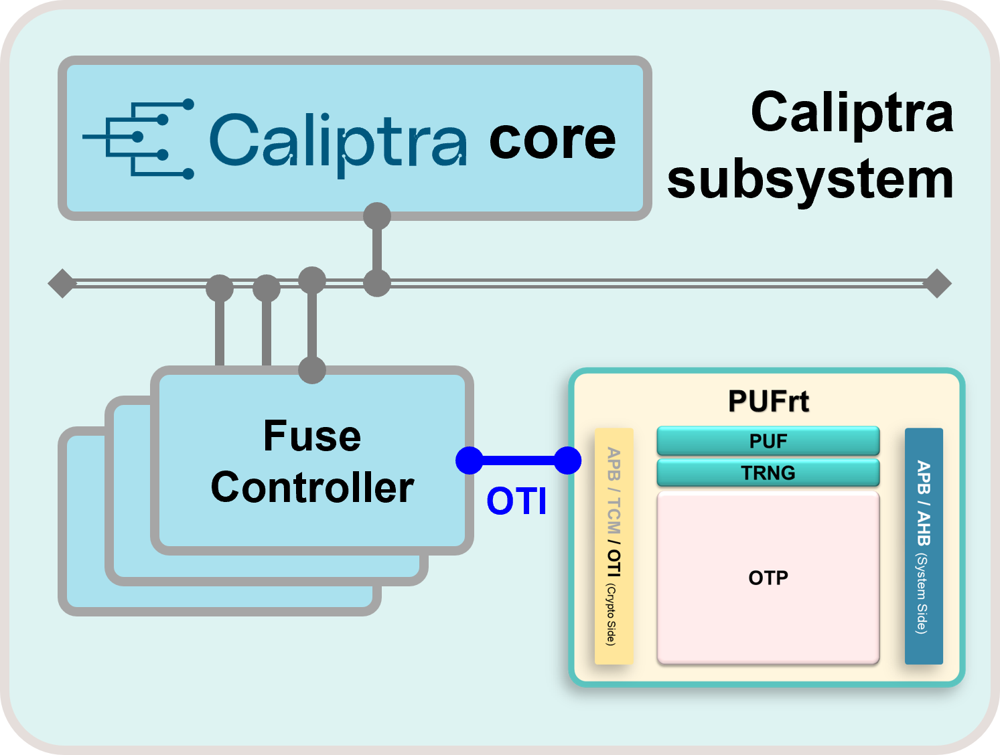

# Bring Up Your Own Caliptra

A pre-integrated Caliptra reference environment that enables developers to start software development on FPGA with confidence.

---

✅ Pre-integrated Caliptra + PUFrt  
✅ Official VCK190 FPGA Reference  
✅ Ready for Firmware and Software Development  

---

## Table of Contents

1. [Introduction](#introduction)
2. [Architecture](#architecture)
3. [Project Roadmap](#project-roadmap)
4. [Build](#build)
5. [Usage](#usage)
6. [More Information & Contact](#more-information--contact)

---

## Introduction

Caliptra provides an open-source Hardware Root of Trust (RoT) RTL foundation for the industry. However, deploying Caliptra in a real SoC requires more than the core RTL — it requires additional hardware security components to be integrated, verified, and made production-ready.

A complete implementation typically requires the integration of a PUF-based UDS generation mechanism, a Noise Source for entropy, and OTP / secure non-volatile storage — all of which must be validated together with the Caliptra subsystem before silicon adoption can begin.

This project provides a **pre-integrated** Caliptra subsystem with PUFrt as a **verified reference design**, built on the official Caliptra FPGA platform (VCK190). The integration has been completed and validated on hardware, giving developers a trustworthy starting point to begin firmware development and system bring-up — without starting from scratch.

---

## Architecture

<p align="left">
  
</p>

The Caliptra core connects to the Fuse Controller over the internal system bus. The Fuse Controller interfaces with PUFrt through the **OTI (One-Time Interface)**, enabling secure access to hardware root-of-trust primitives.

**PUFrt** provides the security foundation required for real silicon deployment:

- **PUF** — generates a unique device secret without storing it in non-volatile memory.
- **TRNG** — hardware entropy source for cryptographic operations.
- **OTP** — secure non-volatile storage for keys and configuration.

PUFrt exposes two interfaces: **APB/TCM/OTI** on the crypto side for Caliptra integration, and **APB/AHB** on the system side for host access.

Together, the Caliptra subsystem and PUFrt form a pre-integrated, verified Root of Trust foundation — ready for firmware development and system bring-up on the official Caliptra VCK190 FPGA platform.

---

## Project Roadmap

<!-- TODO (RD): 請依實際完成進度填寫,建議格式如下

### Completed
- ...

### In Progress
- ...

### Coming Next
- ...

-->

---

## Build

<!-- TODO (RD): 請填寫建置步驟,例如工具鏈、環境需求、build 指令等 -->

### Requirements

-

### Build Steps

```bash

```

---

## Usage

<!-- TODO (RD): 請填寫使用方式,例如燒錄流程、firmware 執行方式、demo 步驟等 -->

---

## More Information & Contact

### Documentation

- Release Notes
- Integration Guide
- API Reference

### Hardware Integration Inquiry

For custom hardware security integration (Caliptra + PUFrt RTL integration, hardware security customization), please contact us at:

📧 [contact email placeholder]

---

## License

This repository is provided for evaluation and development purposes only. 
For commercial deployment, production use, or integration into commercial products, please contact PUFsecurity for licensing terms.
More: [License](LICENSE)
